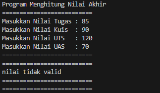
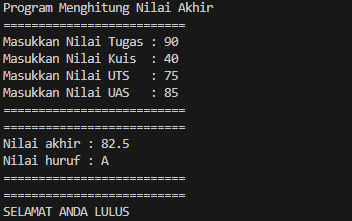
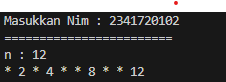
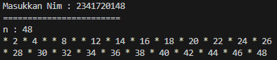
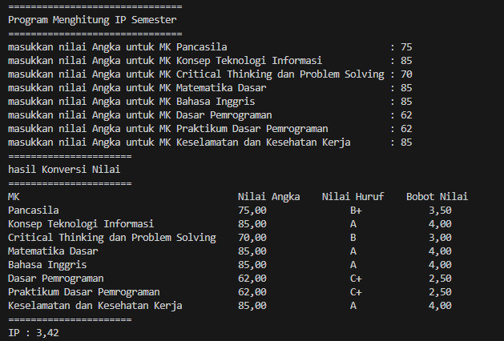

# Laporan Praktikum Pertemuan 1

NIM     : 2341720148

Nama    : Luthfiyyah Adzka Nur Shabrina

Kelas   : TI-1H

## Pemilihan
- **Output**
    
    * Jika nilai tidak valid

        

    * Jika nilai valid
    
        

____
## Perulangan
- **Output**

    * Jika 2 digit akhir NIM < 10

        

    * Jika 2 digit akhir NIM > 10

        

____
## Array
- **Output**

    

____
## Fungsi
- **Output**
    * Menampilkan Pendapatan

        
    * Menampilkan Sisa Stok RoyalGarden 4

        

____
## Tugas
**1. Plat Mobil**
- **Output**

    
**2. Rumus Kecepatan, Jarak dan Waktu**
- **Output**
    * Menu

        
    * Menghitung Kecepatan

        
    * Menghitung Jarak

        
    * Menghitung Waktu

        
    * Keluar Dari Program

        